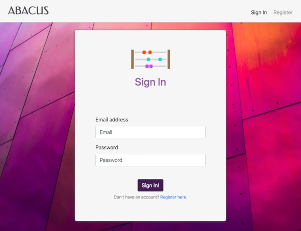
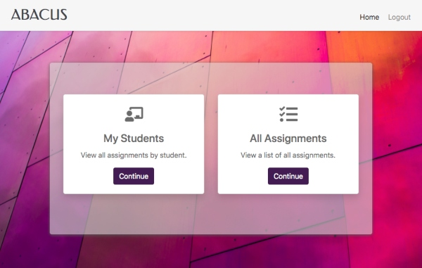
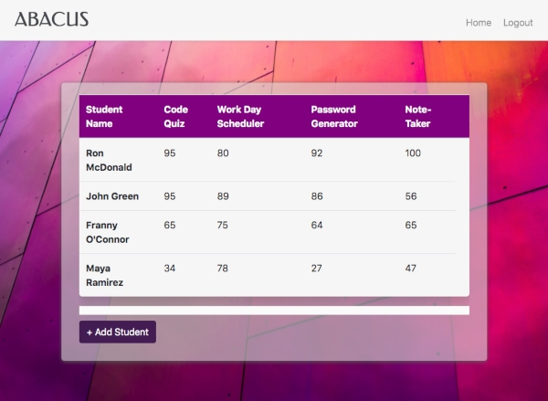
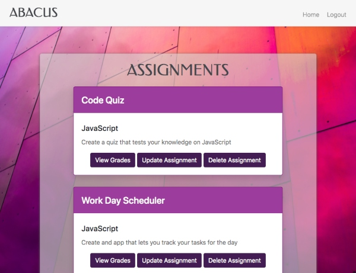

# Abacus
  
## Table of Contents
*  [Description](#Description)
*  [Images](#images)
*  [License](#License)
*  [Contributors](#Contributors)
*  [Contributing](#Contributing)
*  [Contact](#Contact)

## Description
Abacus is designed to help teachers manage their class data. Main technologies utilized for the build include Sequelize, handlebars, jQuery, and Passport. 

Users are able to create unique log ons and add students for their class, add / update / delete assignments, and view grades.

**Deployed Link:** https://em-abacus.herokuapp.com/userportal

To login as a sample user, use the logins below:
- **Email addresss:** sarah.lesson@teach.com
- **Password:** password

- **Email addresss:** jared.councilor@teach.com
- **Password:** password

## Images
### Log In Page

### User Portal

### My Students Page

### Assignments Page

## License
None

## Contributors
- [Andrew Kleiner](https://github.com/akleiner26)
- [Esther Min](https://github.com/jungjungie)  
- [Tim Winters](https://github.com/erasersleeve)

## Contributing
To make contributions or queries, please contact us via github.

## Contact
If you have any questions about this repo, open an issue or contact us directly. You can find more of our work at:
- Andrew Kleiner: https://github.com/akleiner26
- Esther Min: https://github.com/jungjungie
- Tim Winters: https://github.com/erasersleeve
